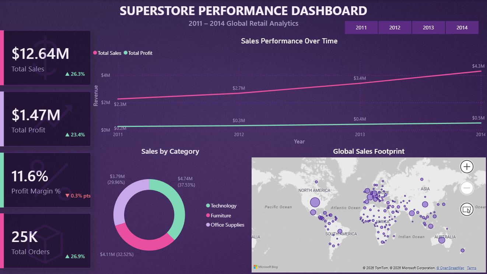
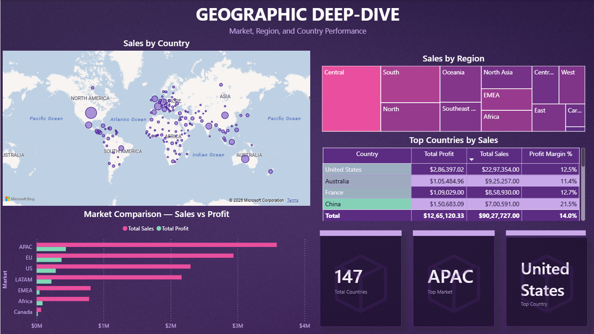
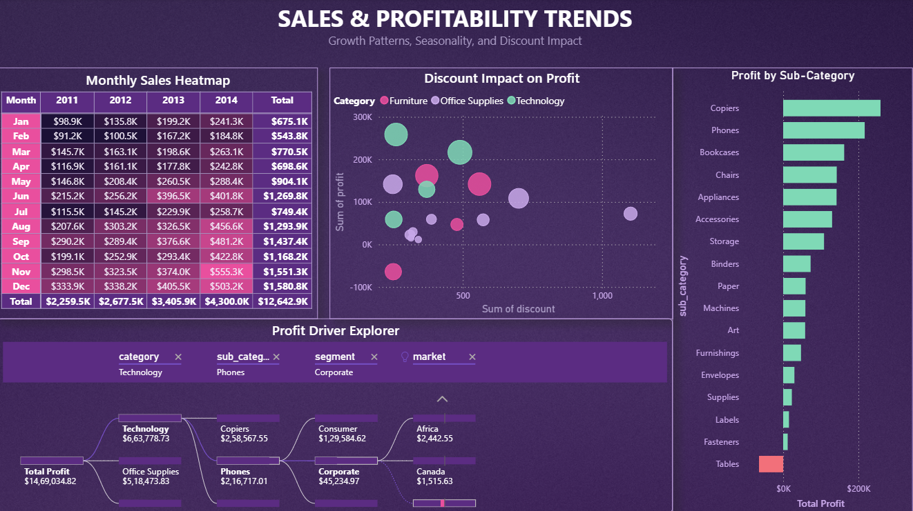

# 🛍️ Global Superstore Performance Dashboard

## 📌 Overview
An interactive Power BI dashboard analyzing **51,290 orders across 147 countries** for a global retail superstore (2011–2014), covering sales performance, profitability, and regional trends — built with custom DAX time-intelligence measures and a fully custom visual theme.

## 🎯 Business Objective
- Track sales and profit performance across markets, regions, and product categories
- Surface year-over-year growth and margin trends using time-intelligence comparisons
- Identify underperforming categories/regions dragging down profitability
- Give decision-makers a drillable view from global performance down to individual order priority

## 🗂️ Dataset
**Source:** Global Superstore dataset — public e-commerce sample dataset
**Size:** 51,290 orders | 2011–2014 | 147 countries across 7 markets (Africa, APAC, EU, EMEA, LATAM, US, Canada)

**Key fields:** order/ship dates, ship mode, customer segment, market/region, product category & sub-category, sales, quantity, discount, profit, shipping cost, order priority

## ⚙️ Tools & Technologies
`Power BI` · `DAX` · `Python (PIL)` for custom visual assets

## 🛠️ Build Highlights
- **Custom DAX time-intelligence** — used `SAMEPERIODLASTYEAR` and related functions to build true year-over-year comparisons
- **Custom gradient background** — generated programmatically in Python (PIL) for a distinct visual identity instead of a default Power BI theme
- **Three-page dashboard** structured for a top-down analysis flow:
  1. **Executive Overview** — KPI cards, sales/profit trend line, category split, global footprint map
  2. **Sales & Profitability Trends** — monthly heatmap, discount-vs-profit analysis, decomposition tree for root-cause profit drivers
  3. **Geographic Deep-Dive** — market/region/country breakdown with profit margin ranking

## 🖼️ Dashboard Preview

## 💡 Key Insights
- **$12.64M in total sales, $1.47M profit** (11.6% margin) across 25K orders — sales nearly doubled from $2.3M (2011) to $4.3M (2014)
- **Margin slipped slightly even as sales grew** — profit margin declined 0.3 pts YoY, indicating revenue growth outpaced profit growth, largely tied to discounting
- **China is the most efficient market, not the biggest** — 21.5% profit margin, nearly double the US's 12.5%, on less than a third of the US's sales volume ($7.01M vs $22.97M)
- **Tables is the only loss-making sub-category** — every other sub-category is profitable; Tables shows a net loss driven by heavy discounting
- **Furniture is the most discount-sensitive category** — high-discount Furniture orders repeatedly dip into negative profit, more than any other category, signaling a need to tighten discount policy there
- **US drives the highest absolute profit** ($2.86M), led by Technology — Copiers and Phones are the single strongest profit-generating sub-categories company-wide

## 📁 Repo Structure

├── data/

│ └── global_superstore_orders.csv

├── dashboard/

│ └── global_superstore.pbix

├── images/

│ ├── executive_overview.png

│ ├── regional_deepdive.png

│ └── decomposition_tree.png

└── README.md

## 🚀 How to Run
Open `dashboard/global_superstore.pbix` in **Power BI Desktop** (free download from Microsoft). Data source path may need to be repointed to `data/global_superstore_orders.csv` if reopening on a different machine.

## 👨‍💻 Author
**Eshwar Ramesh**
Aspiring Data Analyst | Power BI Developer
📧 eshwarramesh1985@gmail.com
🌐 [github.com/EshwarRamesh7](https://github.com/EshwarRamesh7) · [Portfolio](https://eshwarrameshportfolio.netlify.app)
